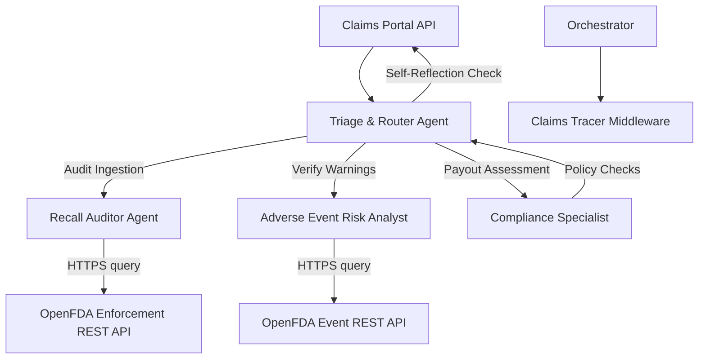

# PharmacoVigilance Claim & Recalls Agent Network

PharmacoVigilance claims auditing is an enterprise-grade agentic solution designed for health insurance providers and pharmaceutical distributors to automate the verification of pharmacy claims against live FDA warnings, active recalls, and safety reports.

By integrating LLM reasoning cycles with the official, live **OpenFDA REST database**, this project demonstrates how to deploy multi-agent workflows in regulated healthcare environments.

---

## 🏗️ Architecture



### Specialist Agents
1. **Triage & Router Agent**: Analyzes claim payloads, delegates steps to the specialists, and conducts a self-reflection pass over the completed notes before publishing approval or rejection verdicts.
2. **FDA Recall Auditor**: Queries OpenFDA live enforcement databases to determine if a prescribed substance has lot-specific or substance-wide recalls.
3. **Adverse Event Risk Analyst**: Audits the total reported count of adverse reactions to verify if safety risk metrics exceed risk thresholds.
4. **Compliance Specialist**: Verifies transaction payout values and completes compliance checks.

---

## 🔑 Secure Connectivity & Integration

- **Live Public API Wrapper**: Connects directly to the live OpenFDA database, retrieving actual enforcement records and event totals.
- **OAuth Middleware simulation**: All agent tool invocations must provide a valid OAuth token (`OAUTH_TOKEN_PV_COMPLIANT_77`). Unauthorized or missing tokens immediately halt the pipeline.

---

## 📊 Observability & Resource Telemetry

The `ClaimsAgentTracer` logs granular execution metrics:
- **Tokens/Sec**: Monitors model efficiency and REST latency.
- **Cost-per-Request**: Calculates billing based on Gemini Developer API pricing.
- **State Transition Traces**: Dumps state snapshots to the `traces/` directory for system audits.

---

## 🧪 Verification Scorecard

The test suite evaluates 5 cases:
1. **Active Recall Audit**: Submits a claim for **Valdecoxib** (a drug withdrawn from the market in 2005). Checked live on OpenFDA, resulting in rejection.
2. **Standard Safe Approval**: Submits a claim for **Metformin** (a safe, active drug). Checked live, resulting in approval.
3. **High Adverse Event Risk**: Submits a claim for **Acetaminophen** (has >10,000 cases in OpenFDA, exceeding the safety threshold of 5,000). Checked live, resulting in escalation.
4. **Value Limit Limit**: Lisinopril claim for \$1200.00. Exceeds the \$1000.00 limit, resulting in escalation.
5. **Expired Token Limit**: Lisinopril claim with expired token, resulting in escalation.

---

## 🚀 Execution Guide

### 1. Installation
Install requirements:
```bash
pip install google-generativeai pydantic
```

### 2. Set Up API Keys (Optional)
If a Gemini API key is configured, the program executes using real LLM calls:
```powershell
$env:GEMINI_API_KEY="your-gemini-key"
```
If no key is set, the system falls back to a local, deterministic agent coordinator that connects to the actual, live OpenFDA endpoints.

### 3. Run Verification Suite
```bash
python main.py eval
```

### 4. Run Custom Claim Audits
```bash
python main.py sim --drug Metformin --payout 85.00
```
Consult the generated `traces/` folder for complete system traces.
